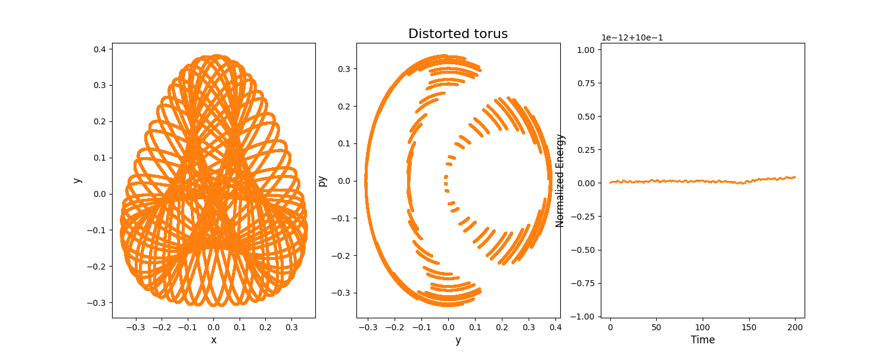

# Henon-Heiles System Integration

This repository contains a Python script for simulating and analyzing trajectories in the Henon-Heiles system using various numerical integration methods.

## Table of Contents
- [Author](#author)
- [Background](#background)
- [Usage](#usage)
- [Installation](#installation)
- [Integration Methods](#integration-methods)
- [Examples](#examples)

## Authors
Alessia Visigalli, PhD student

## Background

The Henon-Heiles system is a classical mechanical system that models the motion of a particle in a two-dimensional potential field. The equations of motion for this system are defined as follows:

$$
\begin{aligned}
\frac{dx}{dt}=p \\
\frac{dp}{dt}=-x-2xy \\
\frac{dy}{dt}=q \\
\frac{dq}{dt}=-y-(x^2-y^2)
\end{aligned}
$$

where `(x, p)` and `(y, q)` are the coordinates and momenta of the two particles, respectively.

## Usage

To use this code, you can run the `henon_heiles.py` script, which allows you to choose different integration methods and initial conditions. The available integration methods include Runge-Kutta 2, Runge-Kutta 4, LeapFrog, and Euler. You can select the initial conditions based on different trajectories of the Henon-Heiles system, such as "Outside separatrix," "Distorted torus," or "Hyperbolic points (separatrices)."

Here's an example of how to use the code:

```bash
python henon_heiles.py --rk2 --outer
```
This command will run the simulation using Runge-Kutta 2 integration method with initial conditions for the outside separatrix.

##Intallation
To get started, follow these steps:
1) Clone this repository to your local machine:
   ```bash
   git clone https://github.com/your-username/henon-heiles.git
   cd henon-heiles
   ```
2) Make sure you have Python and the required dependencies installed. You can install the dependencies using pip:
   ```bash
   pip install -r requirements.txt
   ```
3) Run the code as described in the Usage section.

## Integration methods
This code provides several integration methods to solve the equations of motion:

- Runge-Kutta 2 (RK2): A second-order numerical method.
- Runge-Kutta 4 (RK4): A fourth-order numerical method.
- LeapFrog: A symplectic integration method for Hamiltonian systems.
- Euler: A simple first-order numerical method.

You can choose your preferred method when running the code.

## Examples
Here are some example scenarios and trajectories:
### Outside Separatrix
```bash
python henon_heiles.py --rk2 --outer
```


### Distorted Torus
```bash
python henon_heiles.py --rk4 --torus
```


### Hyperbolic Points (Separatrices)
```bash
python henon_heiles.py --leapfrog --hyperbolic
```

